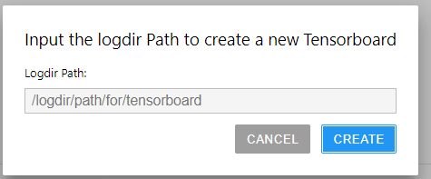

# Jupyterlab-Tensorboard


A JupyterLab extension for tensorboard.

> Note: This project is just a frontend extension for tensorboard on jupyterlab. It use the [jupyter_tensorboard](https://github.com/lspvic/jupyter_tensorboard) project as tensorboard backend.


## Special Thanks

Thanks [lspvic](https://github.com/lspvic) and his excellent work creating [tensorboard](https://github.com/lspvic/jupyter_tensorboard) for jupyter notebooks.

## Prerequisites

* JupyterLab
* [Jupyter_tensorboard](https://github.com/lspvic/jupyter_tensorboard)

## Installation

> Note: please install jupyter_tensorboard first.

```bash
jupyter labextension install jupyterlab_tensorboard
```
## Usage

New card in Launcher to create tensorboard with current working directory as the logdir for tensorboard.


Sidebar shows the running tensorboards. 


User can also use Commands to create a tensorboard with inputting the logdir path.




## Development

For a development install (requires npm version 4 or later), do the following in the repository directory:

```bash
npm install
npm run build
jupyter labextension link .
```

To rebuild the package and the JupyterLab app:

```bash
npm run build
jupyter lab build
```
